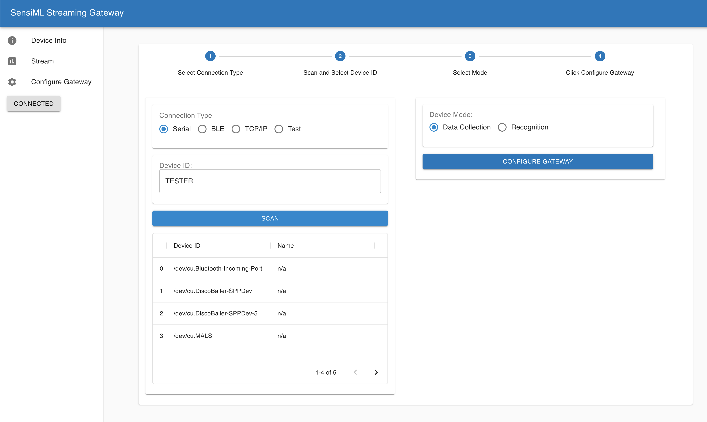
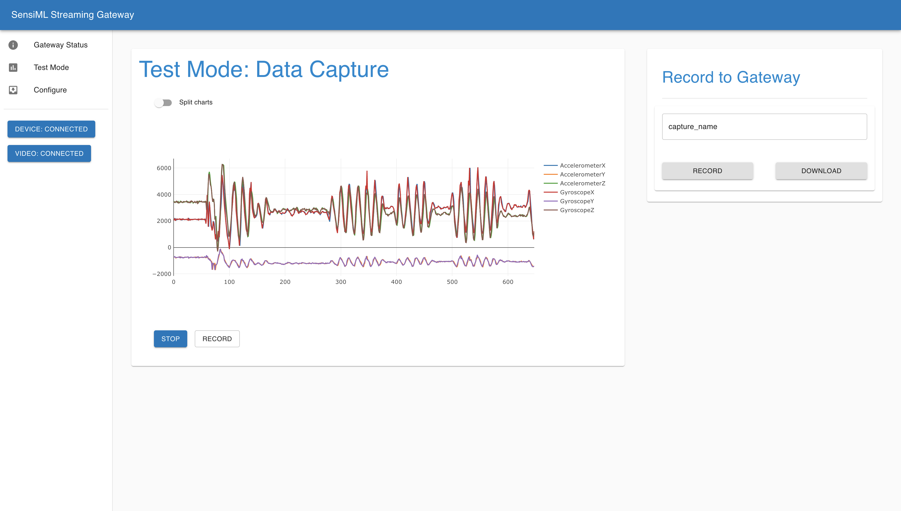
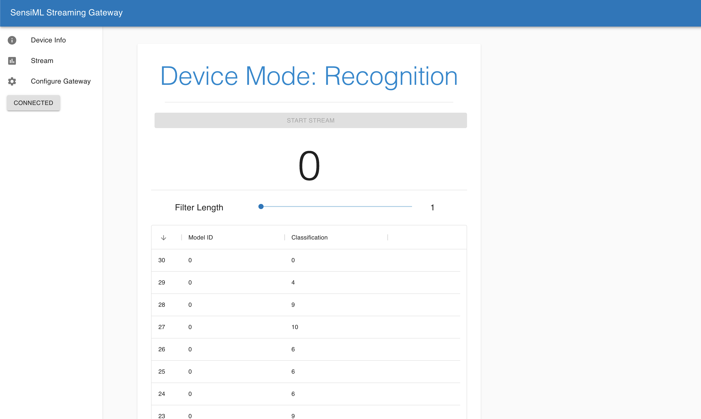
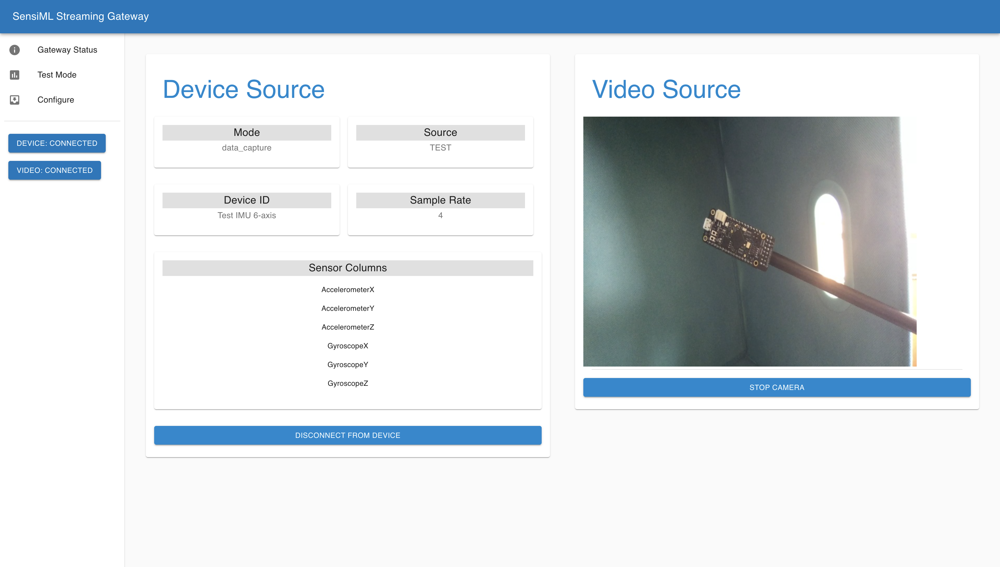

# SensiML Open Gateway

The Open Gateway implements the [Simple Streaming Service protocol](https://sensiml.com/documentation/simple-streaming-specification/introduction.html) to enable forwarding data to the SensiML Data Capture Lab for recording and annotation. The Gateway supports connecting to sensor sources over a Serial, BLE, and TCP/IP connections. It also supports recording video and sensor data locally to the gateway.

## Installation

To install the app dependencies run

```bash
cd simple-streaming-gateway
pip install -r requirements.txt
```

To Start the application run

```bash
python3 app.py
```

## Usage

The Gateway must first be configured to record data from your target sensor. It does that by fetching a configuration json from the source device. You can scan for devices connected over Serial and BLE. The gateway does not support scanning for TCP/IP devices, these addresses must be entered manually into the device id field as <address:port>.



After fetching the configuration your gateway will connect to the device. When connected you will see a Device: Connected status on the left navigation bar. When connected, the Gateway is able to forward sensor data from the source device to the SensiML Data Capture Lab which is used to record and annotate sensor data.

## Data Collection over Serial Source

    1. Connect edge node to Gateway over USB serial
    2. Go to Gateway Configure Screen, Select Serial Radio and Click Scan
    3. Enter the Device ID (which is the port) into the Text Field and Click Configure
    4. The SensiML Gateway is now configured to Stream Data from your Device over Wi-Fi

**NOTE** The BAUD RATE for the serial connection can be changed in the config.py by updating the default BAUD_RATE configuration.

## Data Collection from TCP/IP Source

    1. Connect edge node to network
    2. Go to Gateway Configure Screen, Select TCP/IP Radio Button
    3. Enter the Device ID (address:port) into the Text Field and Click Configure
    4. The SensiML Gateway is now configured to Stream Data from your Device over Wi-Fi

## Data Collection over BLE Source

    1. Connect edge node to Gateway over USB serial
    2. Go to Gateway Configure Screen, Select BLE Radio and Click Scan
    3. Enter the Device ID (which is the port) into the Text Field and Click Configure
    4. The SensiML Gateway is now configured to Stream Data from your Device over Wi-Fi

## Data Capture and Recognition Mode

Data Capture is for capturing raw sensor data, Recognition is for viewing classification results from machine learning models.

### Data Capture



### Recognition

As well as the recognition results stream which shows the classification and model ID.



### Recording Video

In the Gateway Status screen you can start and stop a video source. If you start the video source, it will be recorded along with sensor data when you click the Record Button in the Record to Gateway Widget in Test Mode. You can then download the file to your local machine by hitting the Download Button.



### User Commands

Useful configuration commands when launching the open-gateway

```bash
python app.py -u <host> -p <port> -s <path-to-libsensiml.so-folder> -m <path-to-model-json-file>

-u --host : select the host address for the gateway to launch on
-p --port : select the port address for the gateway to launch on
-s --sml_library_path: set a path a knowledgepack libsensiml.so in order to run the model against the live streaming gateway data
-m --model_json_path: set to the path of them model.json from the knowledgepack and this will use the classmap described in the model json file 
```

### Configuring the Model Class Map

To see mappings from integer class results to text class results you can edit the class map directly in the config.py file. Add the class integer value as the key and the string you would like to show up in the UI as the value.

```python
# Replace this with the dictionary in the model.json file
CLASS_MAP = {65534: "Classification Limit Reached", 0: "Unknown"}
```

For more complicated model hierarchies you can copy the dictionary directly from a model.json file and replace the MODEL_JSON in the config.py file

```python
# replace this with the dictionary in the model.json file
MODEL_JSON = None
```


### Running a knowledge pack on the gateway

In some cases you may want to run a Knowledge Pack on the gateway itself. This is currently possible by turning the Knowledge Pack into a shared object file. Download a Knowledge Pack library for your gateway's platform. Unzip the folder and go to the libsensiml directory. Here you will see a libsensiml.a file. You need to convert this to a shared object by running the following.

```bash
ar -x libsensiml.a
gcc -shared -o libsensiml.so *.o
```

copy the libsensiml.so file to the open-gateway/knowledgepack/libsensiml folder

Alternatively, you can pass the path in when you start the application

```bash
python app.y -s <path-to-libsensiml.so directory>
```

Now connect to your device in data collection mode, switch to the Test Mode tab and click start stream. In the terminal window running the open gateway you will see the model results printed. In the webui you will see the data streaming.

## Using Bluepy on linux

If you would rather use the bluepy driver for ble, you can do that on linux.

```raw
In the sources/__init__.py file comment out the bleak driver import and uncomment the ble driver. Also install the latest version of bluepy
```

```python
# use bluepy ble drivers
#from sources.ble import BLEStreamReader, BLEResultReader
# use bleak ble drivers
from sources.ble_bleak import BLEStreamReader, BLEResultReader
```

**NOTE** To use Bluepy python library you may have to run the following to allow bluepy-helper to access the correct permissions

```bash
find ~/ -name bluepy-helper
cd <PATH>
sudo setcap 'cap_net_raw,cap_net_admin+eip' bluepy-helper
```

### BLE Troubleshooting on Linux

### Cycle Bloothooth on Linux

Sometimes your BLE gets stuck in a weird state and you need to reset it. Instead of cycling the power, just run this command in your shell. You may also need to power cycle the device.

```base
rfkill block bluetooth && rfkill unblock bluetooth
```

### Disable onboard bluetooth raspberry pi (if you have a dongle)

We have noticed some issues with the raspberry pi BLE data drivers when using a camera and streaming data. We recommend using a dongle for video capture and ble streaming on the rpi. To disable the onboard BLE

add the line to /boot/config.txt

```bash
dtoverlay=disable-bt
```

run the commands, you should see only a single output which is the plugged in usb at hcl0 now

```bash
sudo systemctl stop hciuart and sudo systemctl disable hciuart.
sudo hcitool dev
```
